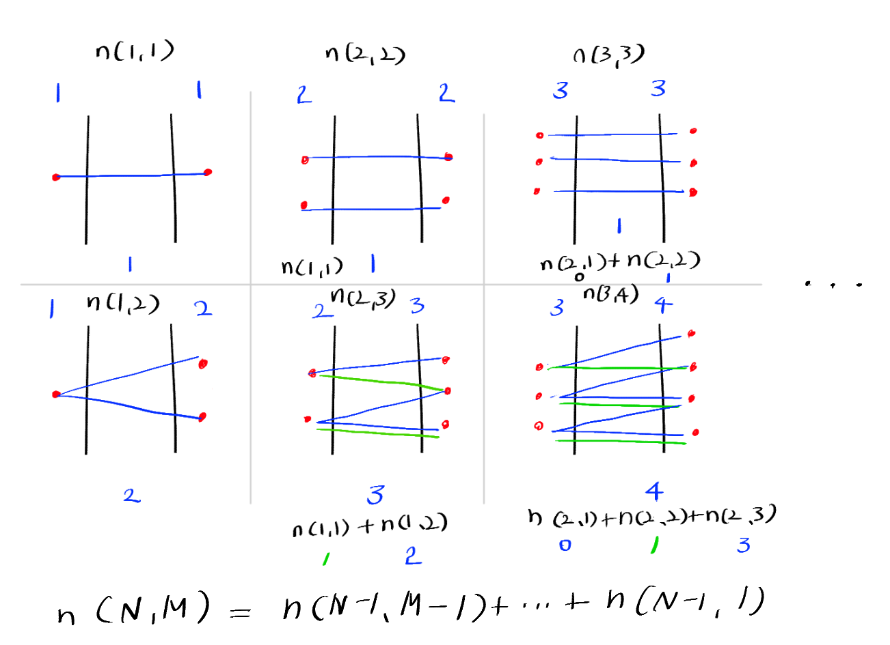

BOJ 1010 다리놓기
==

## 1. Try 1

 
재귀함수를 이용해 아래와 같은 형태로 구현하려고 하였으나 
> (N, M) = (N - 1, M - 1) + ... + (N - 1, 1)  
(N - 1, M - 1) = (N - 1 - 1, M - 1 - 1) + ... + ...  

각 항에 대해 같은 방식을 적용하고, 또 계산하는 과정이 비효율적이고 잘 구현도 되지 않아 풀이 방법을 변경하였다.

## 2. Try 2
인터넷을 참고, 조합을 구하는 공식을 활용하여 풀이하였다.